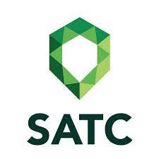

# infosatc-lp-avaliativo-01
 : Atividade avaliativa 01 da disciplina de linguagem de programação do curso técnico de informática SATC 2021
 ## Augusto Frelo Venturini

 

 - Curso de Informática
 - 2° fase do Curso Técnico
 - Turma 2190
 - Liguagem Phyton
 - 1° Prova da disciplina de Linguagem de Programação
